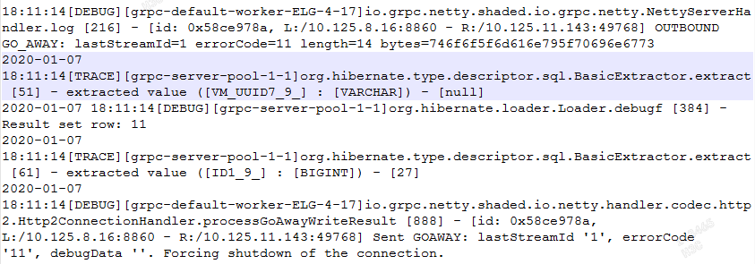

# GRPC异常断连问题定位小记

## 问题描述
公司的业务中使用了GPRC作为跨平台的RPC框架，分为S端和C端。S端由服务平台提供，而C端则是安装在终端的。我们由于业务需要，我们为S端和C端分别构建了简单PRC通道以及双向流，以满足S端可以实现主动推流的需求。近期在排查日志发现，服务端的双向流通道日志里存在大量连接断开的情况。具体的错误是StatusRuntimeException： CANCELLED: cancelled before receiving half close。 这个错误意味着我们的通道是不可靠的，虽然客户端有重连机制，但是在这个断开的短暂时间里，业务会发生中断，影响很大。


## 问题排查
由于日志里能看到异常堆栈，所以排查的时候，我们先尝试从堆栈异常入手。但随后我们发现是有一个异步线程执行的，这个错误的大意是在还未执行onHalfClose的流程时，先执行了onCancel方法，最后导致双向流异常退出。查阅Java Doc后发现，到执行onCancel方法时，服务器会努力中断与处理客户端的消息以节约资源。这个cancel操作可以被超时，网络，客户端或是客户端主动执行取消操作所触发。


但是排查到这里线索就断了。这个错误看起来只是一个某个异常带来的连带后果，真正的错误可能是某个上述中的操作。在这个异常中，既无法看出错误的根源，也没有描述具体是哪个连接发生异常。如何找出错误的真正原因呢？因此为何了错误和具体通信的双方联系在一起，我们在代码中做了一些细微的调整以输出更详细的日志：

1. 首先我们将日志级别调低，调至Trace级别，这样Netty会追踪打印每个链路的发包/收包情况。
2. 在GRPC双向流的onError逻辑中加入如下代码，使用反射获取发生异常时，流通道绑定的Channel信息。


完整的日志就如同下图所示。可以看到，Netty打印出来的日志中，Client的IP地址和我们日志中通过发射的到Channel的IP地址是一一对应起来的，也就是说，就是10.125.8.16~10.125.111.43这条连接出现了故障。而在打印我们自定义的错误之前，Netty曾Sent了几条看起来有点异常的消息，PING，GOAWAY，并且包含了errorCode。发送了这几个消息以后，同一个线程随后触发了onConnectionError逻辑。由于GRPC基于HTTP2协议进行通信，而HTTP2中的GOAWAY帧又是用于启动连接关闭或发出验证错误状态信号，简单说，意思是让对端走开。看来这是一个比较大的怀疑点。此时看一下Netty的源码可能能够帮助我们更快找到错误根源。


由于GRPC中包含的Netty组件不包含源码，我们无法将错误行号对应到具体的代码上。因此我们从Github上下载了grpc-java项目工程，里面包含了grpc-netty-shaded的源码。我们定位到了发送GOAWAY的日志所在。



```java
private static void processGoAwayWriteResult(final ChannelHandlerContext ctx, final int lastStreamId,
                                                 final long errorCode, final ByteBuf debugData, ChannelFuture future) {
        try {
            if (future.isSuccess()) {
                if (errorCode != NO_ERROR.code()) {
                    if (logger.isDebugEnabled()) {
                        logger.debug("{} Sent GOAWAY: lastStreamId '{}', errorCode '{}', " +
                                     "debugData '{}'. Forcing shutdown of the connection.",
                                     ctx.channel(), lastStreamId, errorCode, debugData.toString(UTF_8), future.cause());
                    }
                    ctx.close();
                }
            } else {
                if (logger.isDebugEnabled()) {
                    logger.debug("{} Sending GOAWAY failed: lastStreamId '{}', errorCode '{}', " +
                                 "debugData '{}'. Forcing shutdown of the connection.",
                                 ctx.channel(), lastStreamId, errorCode, debugData.toString(UTF_8), future.cause());
                }
                ctx.close();
            }
        } finally {
            // We're done with the debug data now.
            debugData.release();
        }
    }
```

通过结合日志errorCode=11继续跟踪，发现这个errorCode其实源于一个Http2Error这一个枚举。通过查看调用点发现，这个枚举就是有两处调用。一处是为connection添加一个监听，在服务端收到GoAway消息后，用于判断errorCode是否与此类型相同。另一处则是在onPingRead函数中，发送了带有GOAWAY错误表示的消息。很明显，日志中体现的是第二种情况，服务器主动发送了一个GOAWAY消息。

```java
connection.addListener(new Http2ConnectionAdapter() {
      @Override
      public void onGoAwayReceived(int lastStreamId, long errorCode, ByteBuf debugData) {
        byte[] debugDataBytes = ByteBufUtil.getBytes(debugData);
        goingAway(statusFromGoAway(errorCode, debugDataBytes));
        if (errorCode == Http2Error.ENHANCE_YOUR_CALM.code()) {
          String data = new String(debugDataBytes, UTF_8);
          logger.log(
              Level.WARNING, "Received GOAWAY with ENHANCE_YOUR_CALM. Debug data: {1}", data);
          if ("too_many_pings".equals(data)) {
            tooManyPingsRunnable.run();
          }
        }
      }
```

```java
@Override
    public void onPingRead(ChannelHandlerContext ctx, long data) throws Http2Exception {
      if (keepAliveManager != null) {
        keepAliveManager.onDataReceived();
      }
      if (!keepAliveEnforcer.pingAcceptable()) {
        ByteBuf debugData = ByteBufUtil.writeAscii(ctx.alloc(), "too_many_pings");
        goAway(ctx, connection().remote().lastStreamCreated(), Http2Error.ENHANCE_YOUR_CALM.code(),
            debugData, ctx.newPromise());
        Status status = Status.RESOURCE_EXHAUSTED.withDescription("Too many pings from client");
        try {
          forcefulClose(ctx, new ForcefulCloseCommand(status), ctx.newPromise());
        } catch (Exception ex) {
          onError(ctx, /* outbound= */ true, ex);
        }
      }
    }

```

从调用链分析得知，这个onPingRead是在服务器收到一个读事件时候被触发的。而这个请求数据的帧类型，正是PING类型（其实上面的onPingRead函数名也很清楚了）。PING帧是HTTP一种特殊的帧，经常用来判断一个空闲的连接是否可用。这意味着，服务器是收到了一个来自客户端的PING报文，然后转头和客户端GOAWAY，说BYEBYE了。这里我们不禁感到疑惑，客户端发送的这个PING包是，到底做了什么天怒人怨的事，被下令服务端“驱逐出境”呢？

有趣的是，我们看到在服务端发送GOAWAY指令的时候，发送了一个debugData，这个debugData里的数据，是**too_many_pings**。貌似是说客户端PING的太频繁了。怀疑点就在`keepAliveEnforcer.pingAcceptable()`，如何判断一个Ping是不可接受的呢？

```java
  @CheckReturnValue
  public boolean pingAcceptable() {
    long now = ticker.nanoTime();
    boolean valid;
    if (!hasOutstandingCalls && !permitWithoutCalls) {
      valid = compareNanos(lastValidPingTime + IMPLICIT_PERMIT_TIME_NANOS, now) <= 0;
    } else {
      valid = compareNanos(lastValidPingTime + minTimeNanos, now) <= 0;
    }
    if (!valid) {
      pingStrikes++;
      return !(pingStrikes > MAX_PING_STRIKES);
    } else {
      lastValidPingTime = now;
      return true;
    }
  }
```

真相渐渐浮出水面，首先在这个逻辑里**permitWithoutCalls**是一个构造入参，我们设置的是**False**。而**hasOutstandingCalls**，则表示在这个通道上是否有未完成的RPC调用。如果在无PRC调用的情况下，默认Ping帧的时间间隔是2（**IMPLICIT_PERMIT_TIME_NANOS**是常量，为2小时）小时；而如果在当前存在活跃RPC调用的情况下，Ping帧的时间间隔是5分钟（**minTimeNanos**默认也是常量，为5分钟）。如果客户端没有遵守这个设定，在上述的时间间隔里发送了Ping包，则会被服务器认为是一个Ping攻击（**pingStrikes**）。超过2次ping攻击（**MAX_PING_STRIKES**，常量为2），服务器就会认为这个Ping请求是不可接受或是非法的；于是就发送GOAWAY，一脚踢开客户端了。


```java
goAway(ctx, connection().remote().lastStreamCreated(),Http2Error.ENHANCE_YOUR_CALM.code(),debugData, ctx.newPromise());
```

我们在Github上也找到了一个GRPC关于KeepAlive机制的介绍，里面对服务器发送GOAWAY包有了更详细的描述，大意就是：如果客户端有太多“行为不端”的Ping包，服务器会发送GOAWAY，并且带有ENHANCE_YOUR_CALM（11）错误码给客户端。例如：

1. 如果服务器不允许在没有业务通信的时候发送KEEPALIVE包，但是客户端依旧在没有任何RPC调用的时候发送了大量Ping。
2. 在无数据教务的情况下，客户端的发送PING包间隔超时时间小于服务器接受PING包的间隔时间。

服务器也会认为间隔时间太近的Ping就是Ping攻击，一旦超过判定阈值，服务器会选择断开连接。

## 定位总结
1. 这次问题的定位结论是，由于Client发送了异常频率的Ping包，导致Server判定客户端的行为为Ping攻击行为，从而发送GOAWAY帧，导致双向流连接异常中断。解决的办法有修改客户端的发包间隔和发包策略，还有就是设置服务端的对客户端发包间隔的容忍时间（minTimeNanos）。
2. 客户端组件的同事也存在一个失误，就是没有妥善处理PING帧和GOAWAY帧的响应报文，以至于我们在定位过程中没有及早发现GO_AWAY报文中的**too_many_pings**信息，从而翻阅了大量Netty的源码。如果及早能够发现这个关键信息，相信定位速度会更快。
3. 定位过程中手段需要更加丰富。比如发送的报文完全可以通过抓包截获，从而排查故障时的数据包，定位到异常代码点。尝试过抓包，但是由于GRPC组件使用了TLS加密，报文全变成了密文。尝试过导入密钥解密，但是没有成功。

## 参考文献
https://github.com/grpc/grpc/blob/master/doc/keepalive.md